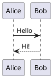
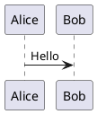
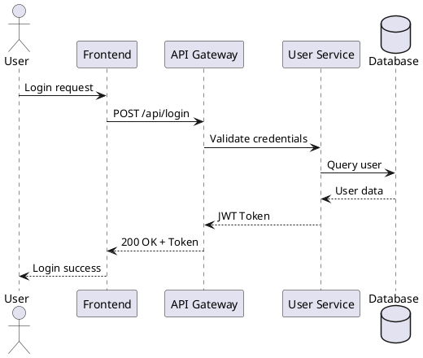
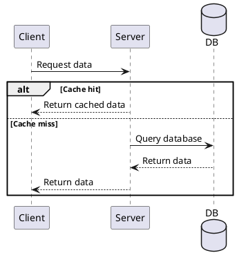
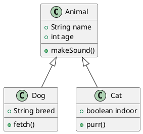
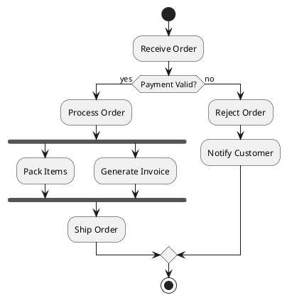
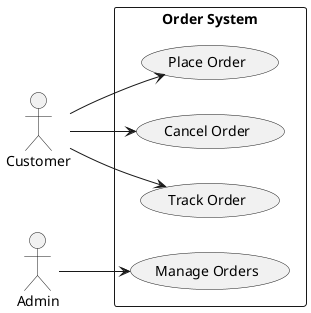
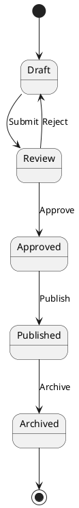

# PlantUML Diagrams

PlantUML is a classic UML modeling tool that lets you create professional diagrams using simple text syntax. Markdown Viewer supports rendering PlantUML diagrams directly in your Markdown documents.

## Supported Diagram Types

- **Sequence Diagram** — API calls, message flows, interactions
- **Class Diagram** — OOP class relationships, interfaces, inheritance
- **Activity Diagram** — Workflows, business processes
- **Use Case Diagram** — System requirements, actor interactions
- **State Diagram** — State machines, lifecycle modeling
- **Component Diagram** — System architecture, dependencies
- **Object Diagram** — Instance relationships

---

## Basic Syntax

Wrap your PlantUML code in a code block with the `plantuml` language identifier:

````markdown

````

You can also use `puml` as the language identifier:

````markdown

````

---

## Sequence Diagram

Perfect for documenting API calls and message flows.

````markdown

````

### Fragments

Use `alt`, `loop`, `opt` for conditional and repeated flows:

````markdown

````

---

## Class Diagram

Define classes, interfaces, and relationships.

````markdown

````

### Relationship Types

```
A <|-- B    Inheritance
A <|.. B    Implementation
A *-- B     Composition
A o-- B     Aggregation
A --> B     Association
A ..> B     Dependency
```

---

## Activity Diagram

Model workflows and business processes.

````markdown

````

---

## Use Case Diagram

Define system requirements and actor interactions.

````markdown

````

---

## State Diagram

Model state machines and lifecycle transitions.

````markdown

````

---

## Tips for Best Results

### Keep Diagrams Focused

- Split complex diagrams into multiple smaller ones
- Use aliases to keep code readable
- Limit diagrams to a manageable number of elements for clarity

### Theme Integration

PlantUML diagrams automatically adapt to your selected theme for consistent styling.

### Standalone Files

You can also create standalone `.plantuml` or `.puml` files and open them directly in Markdown Viewer.

---

## Common Issues

### Diagram Not Rendering?

1. Check syntax — ensure `@startuml` and `@enduml` tags are present
2. Verify the code block specifies `plantuml` or `puml` language
3. Check for typos in arrow syntax (`->`, `-->`, `<--`)

### Layout Issues?

- Use `left to right direction` for horizontal layouts
- Use aliases (`as`) to control element naming
- Add `skinparam` settings to customize appearance

---

## Learn More

- [PlantUML Official Documentation](https://plantuml.com/)
- [PlantUML Language Reference](https://plantuml.com/guide)
