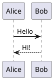
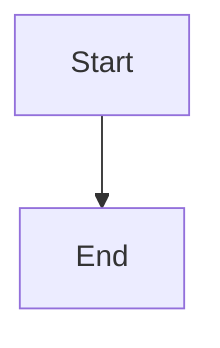

# VS Code Extension

Markdown Viewer is available as a VS Code extension, allowing you to preview and export Markdown documents directly within your editor.

## Overview

| Feature | Status |
|---------|--------|
| Markdown preview | ✅ |
| Word export | ✅ |
| All diagram types | ✅ |
| LaTeX formulas | ✅ |
| 29 themes | ✅ |
| Live preview | ✅ |

**Version:** 5.0.0

---

## Installation

### From VS Code Marketplace

1. Visit [VS Code Marketplace - Markdown Viewer Extension](https://marketplace.visualstudio.com/items?itemName=xicilion.markdown-viewer-extension)
2. Click **Install**
3. Or open VS Code, go to Extensions (`Ctrl+Shift+X` / `Cmd+Shift+X`)
4. Search for **"Markdown Viewer Extension"**
5. Click **Install**

### From Open VSX

For VSCodium or offline installations:

1. Visit [Open VSX - Markdown Viewer Extension](https://open-vsx.org/extension/xicilion/markdown-viewer-extension)
2. Click **Install**

### From Command Line

```bash
code --install-extension xicilion.markdown-viewer-extension
```

---

## Features

### Live Preview

As you edit your Markdown file, the preview updates in real-time.

**Open Preview:**
- Command Palette: `Markdown Viewer: Open Markdown Preview to the Side (Advanced)`
- Keyboard: `Ctrl+Shift+V` / `Cmd+Shift+V`
- Editor title action: `Markdown Viewer`

### Side-by-Side Editing

Edit and preview simultaneously:
- `Ctrl+Shift+V` / `Cmd+Shift+V` — Open the Markdown Viewer panel to the side

### Export to Word

Export the current document to Word:
- Open the preview first, then use the **Export** menu in the preview title bar
- Choose the DOCX export action from the preview UI

---

## Usage

### Opening Preview

1. Open a `.md` file in VS Code
2. Click the **Markdown Viewer** action in the editor title bar
   - Or use keyboard shortcut `Ctrl+Shift+V`
  - Or run `Markdown Viewer: Open Markdown Preview to the Side (Advanced)`
3. Preview opens in a new tab

### Exporting

1. Open the Markdown Viewer preview
2. Click the **Export** menu in the preview title bar
3. Choose the DOCX action
4. Choose a save location if prompted
5. The Word document is created

---

## Settings

Access settings: `File → Preferences → Settings → Markdown Viewer`

| Setting | Default | Description |
|---------|---------|-------------|
| `markdownViewer.theme` | `auto` | Preview theme selection |
| `markdownViewer.fontSize` | `16` | Base preview font size |
| `markdownViewer.fontFamily` | `""` | Custom preview font family |
| `markdownViewer.lineNumbers` | `true` | Show code block line numbers |
| `markdownViewer.scrollSync` | `true` | Sync editor and preview scrolling |
| `markdownViewer.deferAsyncRenderUntilFirstPaint` | `false` | Delay async rendering until first paint for heavy docs |

### settings.json Example

```json
{
  "markdownViewer.theme": "auto",
  "markdownViewer.fontSize": 16,
  "markdownViewer.fontFamily": "Georgia",
  "markdownViewer.lineNumbers": true,
  "markdownViewer.scrollSync": true
}
```

---

## Diagrams in VS Code

All diagram types work in VS Code:

### PlantUML

````markdown

````

### Mermaid

````markdown

````

### Graphviz

````markdown

````

### Vega-Lite

````markdown
```vega-lite
{
  "data": {"values": [{"x": 1, "y": 2}]},
  "mark": "point",
  "encoding": {
    "x": {"field": "x"},
    "y": {"field": "y"}
  }
}
```
````

---

## Keyboard Shortcuts

| Action | Windows/Linux | macOS |
|--------|---------------|-------|
| Open Preview to Side | `Ctrl + Shift + V` | `Cmd + Shift + V` |
| Export / Settings / Print | Use preview title-bar menus | Use preview title-bar menus |

---

## Integration with VS Code

### Works With

- ✅ VS Code built-in Markdown features
- ✅ Git diff view
- ✅ Remote workspaces
- ✅ WSL
- ✅ GitHub Codespaces

### File Types

| Extensions | Language ID | Supported |
|-----------|-------------|-----------|
| `.md`, `.markdown`, `.slides.md` | `markdown` | ✅ |
| `.plantuml`, `.puml` | `plantuml` | ✅ |
| `.mermaid`, `.mmd` | `mermaid` | ✅ |
| `.vega`, `.vl`, `.vega-lite` | `vega` | ✅ |
| `.gv`, `.dot` | `graphviz` | ✅ |
| `.infographic` | `infographic` | ✅ |
| `.canvas` | `canvas` | ✅ |
| `.drawio` | `drawio` | ✅ |

---

## Advantages Over Browser Extension

| Aspect | VS Code | Browser |
|--------|---------|---------|
| **Editing** | Native code editing | View only |
| **Live Preview** | Real-time as you type | Manual refresh |
| **File Management** | Full VS Code features | Browser-based |
| **Git Integration** | Built-in | None |
| **Workspace** | Multi-file projects | Single file |

**Use VS Code** when you're actively writing and editing.
**Use Browser** when you're reading or sharing documents.

---

## Troubleshooting

### Preview Not Showing?

1. Verify the extension is installed and enabled
2. Check file type is `.md` or `.markdown`
3. Try reloading VS Code window (`Ctrl+Shift+P` → "Reload Window")

### Diagrams Not Rendering?

1. Check diagram syntax
2. Wait for initial render (may take a moment)
3. Check VS Code Developer Tools for errors

### Export Fails?

1. Ensure you have write permissions
2. Check available disk space
3. Try a different save location

---

## Development

### Building from Source

```bash
cd vscode
npm install
npm run build
```

### Testing

```bash
npm run test
```

### Debugging

1. Open project in VS Code
2. Press `F5` to launch Extension Development Host
3. Test in the new VS Code window

---

## Source Code

GitHub: [markdown-viewer-extension](https://github.com/markdown-viewer/markdown-viewer-extension)

VS Code-specific code is in the `vscode/` directory.
